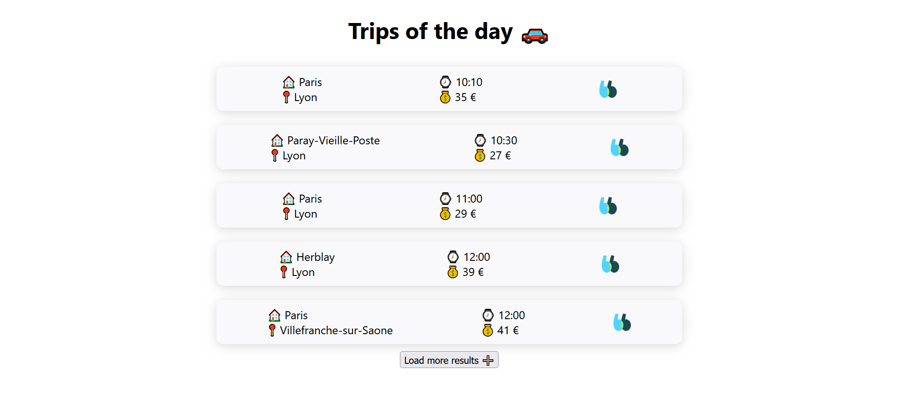

# Blablacar technical test

Blablacar technical test is a small one page web application that renders a search result page of carpooling. It is configured to display the first 5 trips of the current day, but you can display more if you click on the `Load more results` button at the bottom of the page.

This web application has been built in a context of a technical test interview for Blablacar.

You can access the application with this URL: https://maxczd.github.io/blablacar-cazade/

The view is set to display 5 trips. If more are returned by the API, a button appears at the bottom of the view. Clicking on it will display maximum 5 more trips.

<a href="https://maxczd.github.io/blablacar-cazade/">
  <p align="center">
    
  </p>
 </a>
## Architecture

The application is built with ReactJS librairy in Typescript. It communicates with a Blablacar API to fetch data.

# Development

## Setup

### Requirements

- NodeJS (v16.13.2)
- Npm (v8.3.2)

### Install

```bash
# install dependencies
npm install
```

### Run

```bash
# launch the app locally
npm run start
```

or

```bash
# launch the app locally
yarn start
```

### Unit tests

```bash
# run all unit tests
npm run test
```

```bash
# run unit tests coverage
npm run test:coverage
```
